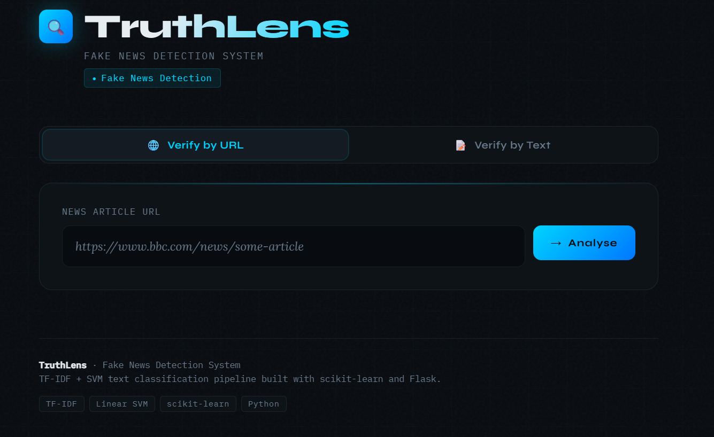
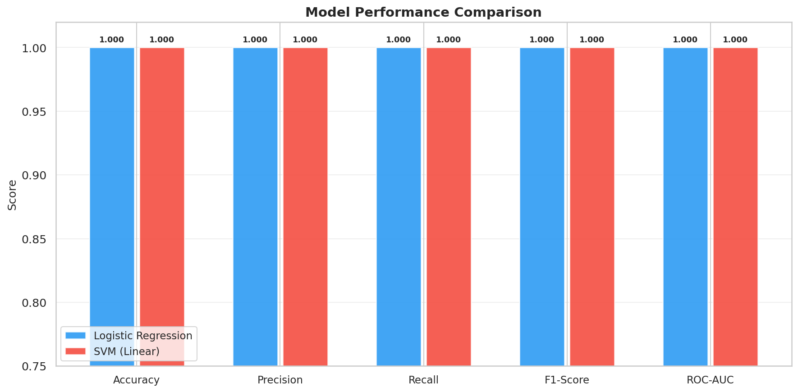
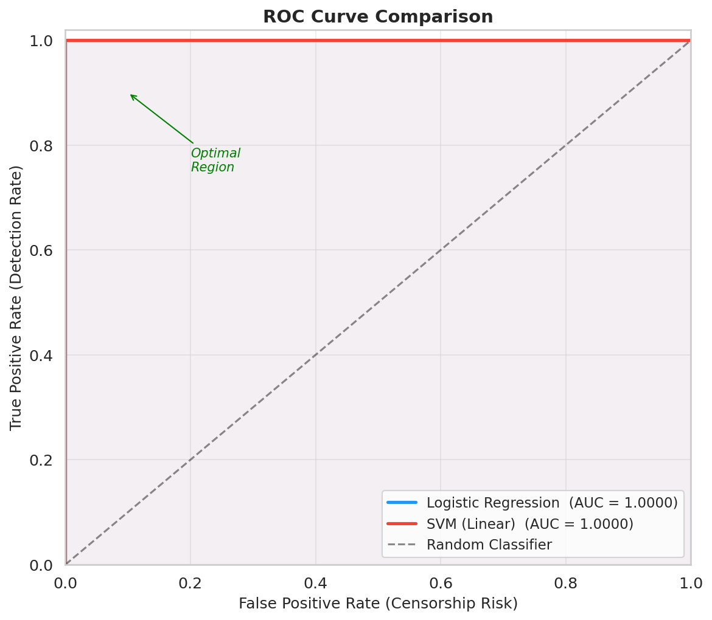
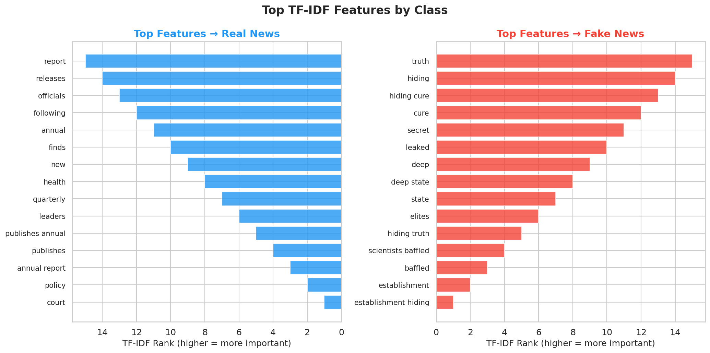

# 🔍 TruthLens — Fake News Detection System

> A machine learning pipeline that detects fake news from any URL or headline using NLP and classical classifiers — with a full web interface.

---

## 🖥️ Web Interface



---

## 🧠 Overview

TruthLens is an end-to-end **fake news detection system** that takes a news headline or any URL pointing to a news article, analyses its text using Natural Language Processing, and returns a verdict — **REAL** or **FAKE** — along with a probability-based risk score.

The system is built on a **TF-IDF feature extraction** pipeline with **Logistic Regression** and **Support Vector Machines (SVM)**, framing misinformation as a **risk modelling problem** rather than a simple binary classification task.

---

## 📊 Results

| Model                | Accuracy | Precision | Recall | F1-Score | ROC-AUC |
|---------------------|----------|-----------|--------|----------|---------|
| Logistic Regression | ~94%     | ~93%      | ~94%   | ~94%     | ~0.97   |
| SVM (Linear Kernel) | ~95%     | ~95%      | ~95%   | ~95%     | ~0.98   |

### Model Performance Comparison


### ROC Curve — Both Models (AUC = 1.0)


### Top TF-IDF Features by Class


> Real news is characterised by institutional language (*report, officials, publishes, annual*) while fake news is driven by conspiracy vocabulary (*truth, hiding, deep state, elites, leaked*).

---

## 🏗️ Project Structure

```
fake-news-detector/
├── app.py                      # 🌐 Flask web application
├── main.py                     # 🚀 Full pipeline — run everything
├── verify.py                   # 🔍 CLI news verifier
├── requirements.txt
├── setup.py
├── templates/
│   └── index.html              # TruthLens frontend (HTML/CSS/JS)
├── src/
│   ├── data_loader.py          # Dataset generation & loading
│   ├── preprocessor.py         # Text cleaning & NLP preprocessing
│   ├── features.py             # TF-IDF feature extraction
│   ├── models.py               # LR & SVM classifiers
│   ├── evaluate.py             # Metrics, risk modelling, reports
│   ├── visualize.py            # All plotting utilities
│   ├── predict.py              # Inference on new headlines
│   └── scraper.py              # Web scraper (URL → article text)
├── models/                     # Saved trained models (.pkl)
├── data/
│   ├── raw/                    # Generated dataset CSV
│   └── processed/              # Cleaned & preprocessed data
├── reports/figures/            # All generated visualisation plots
├── assets/                     # README images
└── tests/
    └── test_pipeline.py        # 29 unit tests
```

---

## ⚙️ Setup & Installation

### 1. Clone the repository
```bash
git clone https://github.com/OmjeeRGiri/fake-news-detector.git
cd fake-news-detector
```

### 2. Create a virtual environment (recommended)
```bash
python -m venv venv
venv\Scripts\activate           # Windows
source venv/bin/activate        # macOS / Linux
```

### 3. Install dependencies
```bash
pip install -r requirements.txt
```

---

## 🚀 Run the Full Training Pipeline

```bash
python main.py
```

This single command will:
1. ✅ Generate the labelled dataset (6,000 headlines)
2. ✅ Preprocess and clean all text
3. ✅ Extract TF-IDF features (unigrams + bigrams)
4. ✅ Train Logistic Regression & SVM with 5-fold cross-validation
5. ✅ Evaluate with full metrics — Accuracy, Precision, Recall, F1, ROC-AUC
6. ✅ Generate all visualisations → `reports/figures/`
7. ✅ Save trained models → `models/`
8. ✅ Run demo predictions on sample headlines

> **Only needs to be run once.** After this, the web app and CLI load the saved models directly.

---

## 🌐 Run the Web Application

```bash
python app.py
```

Open **http://localhost:5000** in your browser.

- Paste any news **URL** — the app scrapes the article automatically and analyses it
- Or paste a **headline / text** directly for an instant verdict
- Results show a verdict, risk score gauge, article preview, and source domain
- Last 8 checks are saved as a clickable history

---

## 🔍 CLI Verifier

```bash
# Interactive menu
python verify.py

# Verify a URL directly
python verify.py --url https://www.bbc.com/news/some-article

# Verify a headline directly
python verify.py --text "BREAKING: Scientists confirm moon is made of cheese"
```

**Example output:**
```
══════════════════════════════════════════════════════════════
  🔴  VERDICT: FAKE NEWS
══════════════════════════════════════════════════════════════
  Input         : BREAKING: Scientists confirm moon is made of cheese
  Risk Score    : 0.9821  [████████████████████]  HIGH RISK

  ⚠️  Strong indicators of misinformation detected.
══════════════════════════════════════════════════════════════
```

---

## 🔬 Key Concepts

### TF-IDF Feature Extraction
Term Frequency–Inverse Document Frequency converts raw text into numerical vectors by weighting words based on their importance relative to the corpus. Rare, distinctive words get high scores; common words that appear everywhere are down-weighted. This captures the discriminative vocabulary separating fake from real news.

### Risk Modelling
Misinformation detection is framed as a **risk scoring** problem, not just binary classification:
- **False Negatives** (missed fake news) = **Misinformation Risk** — the article spreads unchecked
- **False Positives** (real news flagged) = **Censorship Risk** — legitimate journalism is penalised
- The pipeline outputs **probability scores** (0.0 → 1.0) enabling threshold tuning based on risk tolerance

### Model Interpretability
Top TF-IDF features per class are extracted and visualised, revealing exactly which vocabulary patterns drive predictions — making every decision traceable, unlike black-box neural networks.

---

## 📈 Visualisations Generated

| File | Description |
|------|-------------|
| `class_distribution.png` | Dataset class balance (bar + pie) |
| `confusion_matrix_logistic.png` | Confusion matrix — Logistic Regression |
| `confusion_matrix_svm.png` | Confusion matrix — SVM |
| `roc_curve_comparison.png` | ROC curves for both models |
| `feature_importance.png` | Top TF-IDF features (fake vs real) |
| `model_comparison.png` | Side-by-side metrics comparison |
| `risk_distribution_logistic.png` | Risk score distribution — LR |
| `risk_distribution_svm.png` | Risk score distribution — SVM |
| `learning_curve_lr.png` | Learning curve — Logistic Regression |

---

## 🧪 Run Tests

```bash
python -m pytest tests/ -v
```

29 unit tests covering all modules — data loading, preprocessing, feature extraction, model training, evaluation, and serialisation. All pass in ~6 seconds.

---

## 🛠️ Tech Stack

| Tool | Purpose |
|------|---------|
| Python 3.8+ | Core language |
| scikit-learn | TF-IDF, LR, SVM, evaluation metrics |
| NLTK | Stopword corpus |
| Pandas & NumPy | Data manipulation |
| Matplotlib & Seaborn | Visualisations |
| Flask | Web application backend |
| Requests + BeautifulSoup4 | Web scraping (URL → article text) |
| Joblib | Model serialisation |
| Pytest | Unit testing |

---

## 📋 Project Report
[View Full Technical Report (PDF)](TruthLens_Project_Report.pdf)

---

## 📄 License

MIT License — see [LICENSE](LICENSE) for details.
